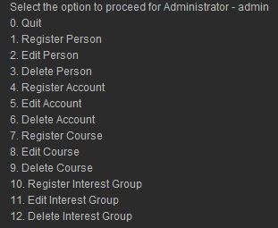
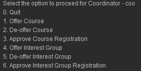
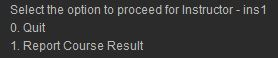
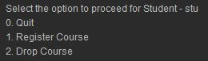
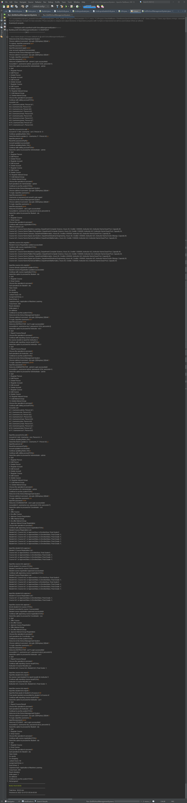
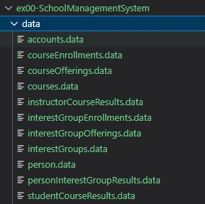

# Ex000 - School Management System
This project implements an School Management system with CRUD of data stored in binary files. This system allows signup of new accounts and person. The accounts can be linked to registered person. The person have roles such as Administrator, Coordinator, Instructor, and Student. Each role can perform different functionalities as shown in later section.

This project is to review the knoweledge regarding the OOP concepts in Java. Also, advanced data types are extensively used such as ArrayList, Set, Map, Object, nested maps. 

## 0. IDE
NetBeans 13

## 1. Screens

### 1.1 Functionalities of roles
<b>Administrator</b> 

<b>Coordinator</b> 

<b>Instructor</b> 

<b>Student</b> 

### 1.2 Sample of output

### 1.3 The data files

## 2. Demo
[demo](https://youtu.be/ZKdqaubEq2Y)

## 3. How to run the code
- Download `ex00-SchoolManagementSystem` and open with NetBeans, navigate to `src/main/java/handypan/ex00/SchoolManagementSystem`, run (Shift+F6) `Ex00SchoolManagementSystem.java`.

## 4. Todo
Some codes need to be updated to implement the transactions when data is modified. For example, when `person` is deleted, multiple `.data` files need to be updated. This will be fixed in the later versions.