# Ex001 - ATM
This project implements an ATM system with CRUD of MySQL database. This system allows signup of new accounts. Users can login, logout, change pin code, deposit, withdraw, withdraw with fast cash, and view statements.

## 0. IDE
NetBeans 13 
MySQL by Xampp - phpMyAdmin 5.0.4

## 1. Screens

### 1.1 MySQL
<b>Database</b> 
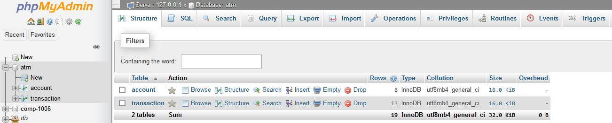
<b>Tables</b> 
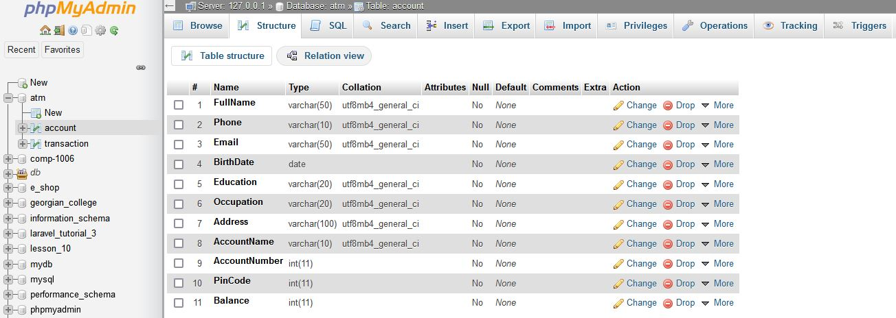
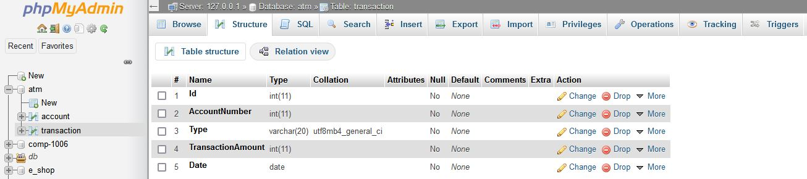

### 1.2 ATM
<b>Start</b> 
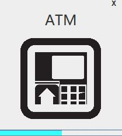

<b>Login</b> 
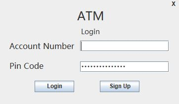

<b>Sign Up</b> 
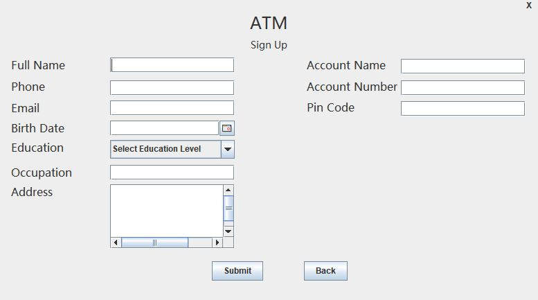

<b>Main Menu</b> 
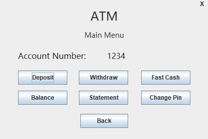

<b>Deposit</b> 
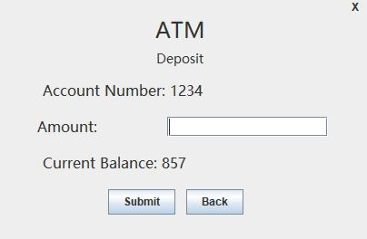

<b>Withdraw</b> 
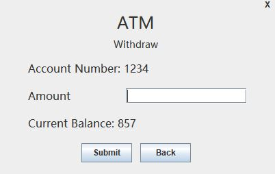

<b>Fast Cash</b> 
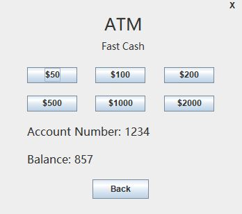

<b>Balance</b> 
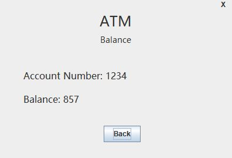

<b>Statement</b> 
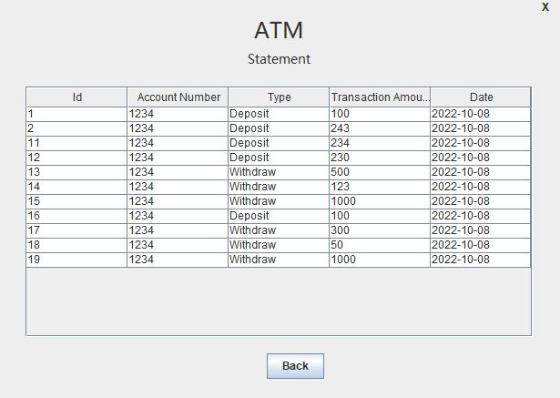

<b>Change Pin</b> 
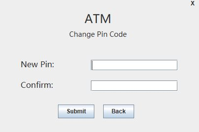

## 2. Demo
To be included.

## 3. How to run the code
- Configure the database as shown above. Database name is `atm`, the two tables are `account` and `transaction`. Refer to above screenshots (1.1) for details of column names.
- Download `ex01-ATM` and open with NetBeans, navigate to `src/main/java/ex01atm`, run (Shift+F6) `Ex01ATM.java` or `Start.java`.